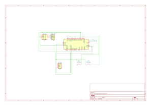

# DIY Arduino Kitchen Scale
A custom-built digital scale featuring hardware taring and multi-unit tracking via an HX711 amplifier and an I2C LCD.

This project transforms an Arduino Uno into a precise digital kitchen scale. It uses a 4-wire load cell, an HX711 amplifier, and a 16x2 I2C LCD display. The scale features dedicated physical push buttons to reset the weight to zero (tare) and seamlessly toggle between grams, ounces, and milliliters. A custom non-blocking UI animation displays on the LCD during the startup and taring sequences.

## Project Showcase

<video src="images%20and%20video/video.mp4" controls="controls" width="600"></video>

## Hardware Required

* 1x Arduino Uno R3
* 1x HX711 Load Cell Amplifier Module
* 1x 20kg Load Cell 
* 1x 16x2 I2C LCD Display
* 2x Momentary Push Buttons
* Breadboard and jumper wires

## Hardware Schematic

### Wiring Reference

| Component | Module Pin | Arduino Uno Pin |
| :--- | :--- | :--- |
| **HX711** | DT | D2 |
| **HX711** | SCK | D3 |
| **I2C LCD** | SDA | A4 |
| **I2C LCD** | SCL | A5 |
| **Tare Button** | Signal | D13 (INPUT_PULLUP) |
| **Unit Button** | Signal | D12 (INPUT_PULLUP) |

> Note: The 4-wire load cell connects directly to the HX711 via E+ (Red), E- (Black), A- (White), and A+ (Green). All buttons are wired to a common ground.

## Installation Instructions for Users

1. Assemble the hardware according to the schematic and wiring reference above.
2. Clone or download this repository to your local machine.
3. Open `scale_code/scale_code.ino` in the Arduino IDE.
4. Go to **Sketch > Include Library > Manage Libraries** and install the `LiquidCrystal_I2C` and `HX711` libraries.
5. Connect your Arduino Uno via USB and click **Upload**.
6. (Optional) Open the Serial Monitor (set to **9600 baud**) to view real-time weight data and debugging output.

## Installation Instructions for Developers

If you are modifying the load cell hardware, swapping out the sensor, or building your own physical enclosure, you must recalibrate the scale factor:
1. Open `calibration_scale/calibration_scale.ino` in the Arduino IDE and upload it to the board.
2. Open the Serial Monitor (set to **57600 baud**).
3. Place a known weight on the scale and follow the serial prompts to adjust the raw calibration value.
4. Copy the final value and update the `calibration_factor` variable at the top of `scale_code/scale_code.ino`.
5. Upload the main `scale_code.ino` sketch to finalize the build.

## Known Issues

* **Volatile Memory:** The selected unit state (g, oz, ml) resets to grams when the Arduino loses power because the state is not currently written to the EEPROM.
